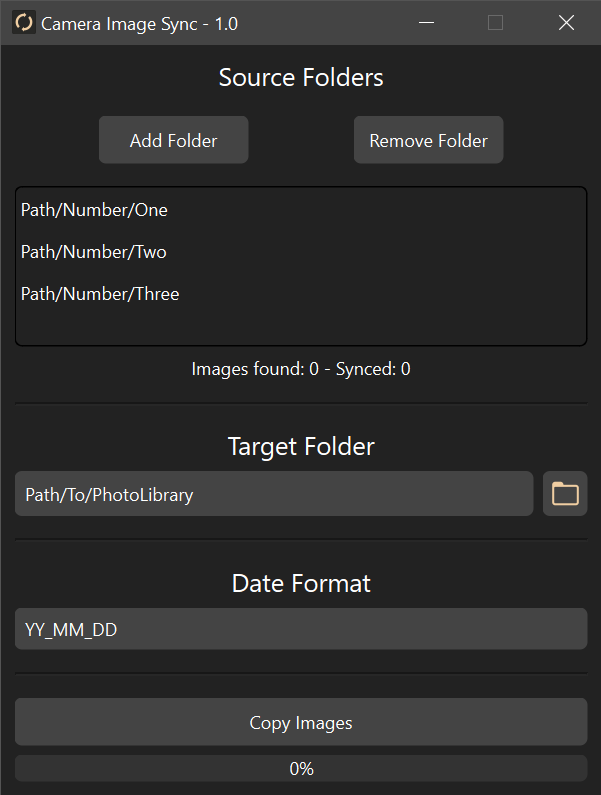

# Camera Image Sync



## Overview
Camera Image Sync is a Python program designed to simplify the process of synchronizing pictures from your camera with your picture library. With this program, you can effortlessly organize and manage your camera images by automatically creating folders based on your desired date naming convention. 

## Features
- **Automatic Date-based Folder Creation:** Camera Image Sync automatically reads the date of creation of the images and creates folders based on your specified date naming convention.
- **User-friendly Interface:** The program provides a graphical user interface (GUI) built with PySide6, allowing you to easily interact with the application and customize your synchronization preferences.
- **Efficient Image Synchronization:** The program efficiently synchronizes pictures from your camera to your picture library, ensuring that all new images are organized properly.

## Dependencies
- **Python 3.11.3:** Camera Image Sync is developed using Python 3.11.3. Make sure you have Python 3.11.3 installed on your system.
- **PySide6:** The program relies on the PySide6 library to create the graphical user interface
## Getting Started
1. Ensure you have Python 3.11.3 installed on your system. If not, download and install it from the official Python website.
2. Install the PySide6 library by running the following command in your terminal:

```shell
pip install PySide6
```

3. Download the Camera Image Sync program from the provided source or repository.

```shell
git clone https://github.com/Design0r/Camera_Image_Sync.git
```
4. Open the program in your preferred Python integrated development environment (IDE) or text editor.
5. Customize your date naming convention by modifying the relevant settings in the program's user interface.
6. Connect your camera to your computer and ensure it is recognized.
7. Run the program, and it will automatically sync the pictures on your camera with your picture library, organizing them based on the specified date naming convention.

## Usage
1. Launch the Camera Image Sync program.
2. Connect your camera to your computer and ensure it is detected.
3. Configure your desired date naming convention in the program's user interface.
4. Add Source and Target Folders in the program's user interface.
5. Click the "Copy Images" button to initiate the synchronization process.
6. Camera Image Sync will read the date of creation for each image on your camera and create folders in your picture library based on the specified date naming convention.
7. All pictures will be synced to their respective folders, ensuring a well-organized picture library.

## Conclusion
Camera Image Sync simplifies the task of synchronizing your camera pictures with your picture library. With its automatic date-based folder creation and user-friendly interface, you can easily organize and manage your images. Download the program, specify your date naming convention, and enjoy a well-organized picture library effortlessly.
****